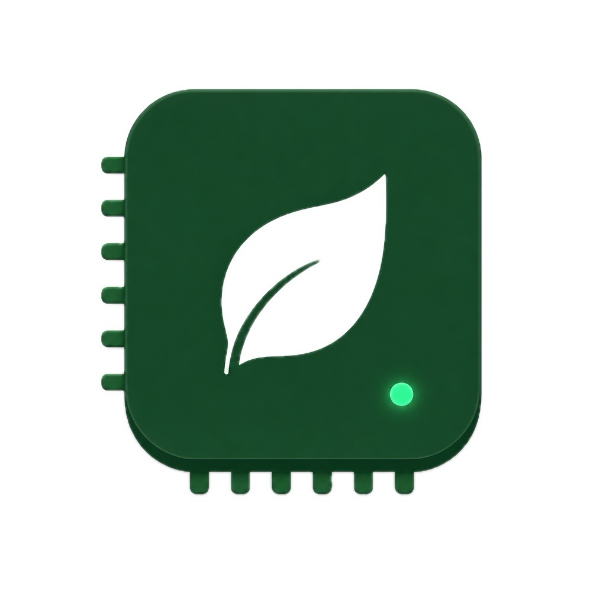

<p align="center">
  
</p>

# Grove Fit

**Open hardware fit for local AI — powered by [llmfit](https://github.com/AlexsJones/llmfit), curated for [Boske](https://boske.dev).**

> *Can your machine run this model?*

[](./LICENSE)
[](https://github.com/AlexsJones/llmfit)

Try the live calculator: **[boske.dev/fit](https://boske.dev/fit)** (client-side — no hardware upload).

Desktop apps for macOS, Windows and Linux are built from a `v*` tag and attached to
[Releases](https://github.com/boske-ai/grove-fit/releases). They are currently
**unsigned** — macOS needs right-click → Open on first launch, Windows shows a
SmartScreen warning.

## Quick start

```bash
bun install
bun run gui          # native Tauri window (macOS / Windows / Linux)
# or
bun run dev:web      # browser UI → http://127.0.0.1:3847
```

Optional richer hardware scan: install [llmfit](https://github.com/AlexsJones/llmfit) (`brew install AlexsJones/llmfit/llmfit`).

All build and sync scripts are Node — they run on Windows, macOS and Linux alike.

CLI:

```bash
bun run --cwd packages/cli start system
bun run --cwd packages/cli start search "llama 8b"
```

## What it does

Grove Fit answers which **local models** fit a machine’s RAM, GPU, and backend — with **Boske tiers first**, a searchable catalog of **5,000+** models synced from llmfit, and a soft funnel when a third-party model matches a Boske size class.

| Surface | How hardware is known |
|---------|----------------------|
| [boske.dev/fit](https://boske.dev/fit) | Manual form + WebGPU hints |
| `grove-fit` CLI | llmfit or native OS probes |
| Desktop / mobile companions | Tauri sidecar / Capacitor plugins |

**Architecture in one line:** llmfit is the base; Grove Fit is the elevation (Boske overlay, certified badges, Breeze / Summit cloud fallback, static catalog).

Details: [`docs/architecture.md`](./docs/architecture.md) · decisions: [`docs/decisions.md`](./docs/decisions.md)
· embedding it elsewhere: [`docs/using-in-boske.md`](./docs/using-in-boske.md).

## Building the desktop app

```bash
bun run --cwd apps/desktop build   # bundles for the host platform
```

Output lands in `apps/desktop/src-tauri/target/release/bundle/`. Each platform
builds on its own machine — Tauri cannot practically cross-compile, since Windows
needs the MSVC linker and `llvm-rc`, and Linux needs webkit2gtk/gtk3. CI does all
three on native runners.

Install [llmfit](https://github.com/AlexsJones/llmfit) first for richer GPU
detection; without it the app falls back to native OS probes, and the build stages
a stub rather than shipping an unverified binary.

## Repo layout

```
grove-fit/
├── apps/web|desktop|mobile   # Vite · Tauri 2 · Capacitor
├── packages/
│   ├── core · detect · ui    # fit engine, HW adapters, shared UI
│   ├── models                # boske-catalog + synced llmfit export
│   ├── cli · conformance
├── scripts/                  # monthly catalog sync from llmfit
└── docs/
```

## Contributing

See [`CONTRIBUTING.md`](./CONTRIBUTING.md). Please read [`CODE_OF_CONDUCT.md`](./CODE_OF_CONDUCT.md) and [`SECURITY.md`](./SECURITY.md).

## License and attribution

- **Code:** MIT — [`LICENSE`](./LICENSE)
- **Catalog / optional llmfit sidecar:** derived from [llmfit](https://github.com/AlexsJones/llmfit) (MIT) — see [`THIRD_PARTY_NOTICES.md`](./THIRD_PARTY_NOTICES.md)

**Boske**, **Boske Labs**, **Grove Fit**, and **Grove Fit certified** are trademarks / product names of Canopy Studio / Boske Labs. MIT does **not** grant trademark rights; forks must not imply endorsement.

npm packages (`@boske-labs/grove-fit-*`) are prepared but **not published yet** — use a
git dependency or vendor `packages/core/src/`. See
[`docs/using-in-boske.md`](./docs/using-in-boske.md) for the options and the stable
API surface.
